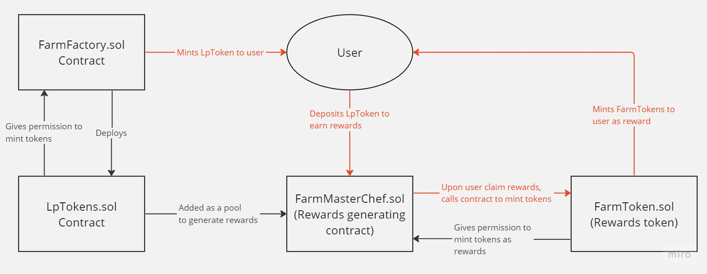

# farming-app
A Farming dApp where users can earn FARM tokens by depositing LPTOKENS. Smart Contract is built on solidity and frontend is using React. 

## Contract Overview

## For testing of smart contracts locally
- Ensure ganache-cli and web3 is installed globally
- run ganache-cli in terminal to start up local blockchain
- run truffle test in terminal to run tests

## For Dev Testing in ganache when want to connect to metamask [Warning: Do not use for anything else]:
- ensure settings in connectwalletreducer is set
- ganache-cli --mnemonic "tray trip forward glow debris monitor target wool island demand disorder adapt"
- truffle migrate --reset
- npm start
- Note: If face nonce errors during testing, go to settings in metamask for the account => Advanced => Clear activity tab data

## Contract Locations
- FarmFactory: 0x51B341ab50fF8B5f05A1Ef9aDa8B3151F09A3024
- https://goerli.etherscan.io/address/0x51b341ab50ff8b5f05a1ef9ada8b3151f09a3024#code

- LP1: 0xF9cb3954570eD68e5E88a4098eb9F3DAbbE191C3
- https://goerli.etherscan.io/address/0xF9cb3954570eD68e5E88a4098eb9F3DAbbE191C3

- LP2: 0xD62AEe048caC123e0Cbd9ab7E8ba779c379aa5EE
- https://goerli.etherscan.io/address/0xD62AEe048caC123e0Cbd9ab7E8ba779c379aa5EE

- LP3: 0x6f6bbdA83A096431B3b9D433bCF492853eD5d0Ef
- https://goerli.etherscan.io/address/0x6f6bbdA83A096431B3b9D433bCF492853eD5d0Ef

- FarmToken: 0x554BeDE4c6f16A8eDb6e9a69a5BBBd2e3f6FfF2D
- https://goerli.etherscan.io/address/0x554bede4c6f16a8edb6e9a69a5bbbd2e3f6fff2d

- Masterchef: 0x3eBDF96C2932BAe3c27d617143B3c5675599cd54
- https://goerli.etherscan.io/address/0x3ebdf96c2932bae3c27d617143b3c5675599cd54#code